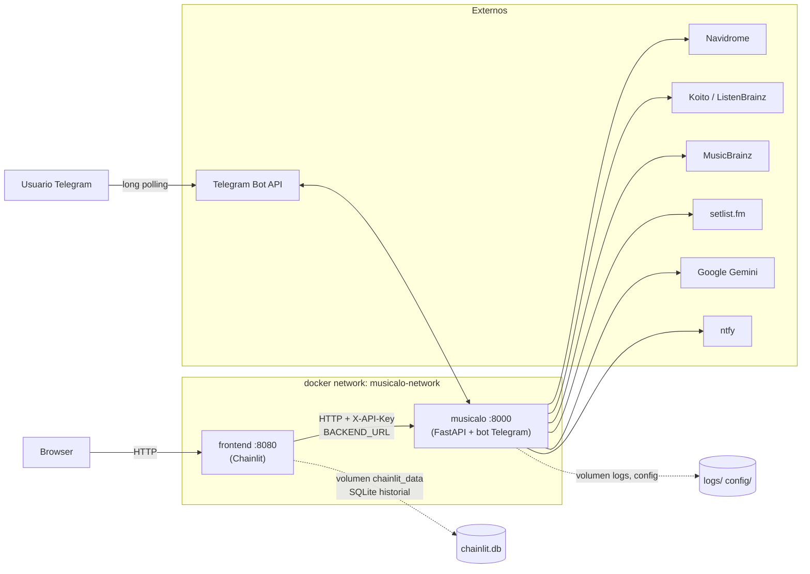

# Arquitectura

Cómo está construido Musicalo hoy — componentes, cómo se comunican, dónde vive el estado y cómo se despliega. El README explica el *qué* (funcionalidades, instalación, variables de entorno); este documento explica el *cómo* con referencias a fichero real. Si cambias algo de lo que hay aquí (un servicio nuevo, un cambio de protocolo, dónde vive un dato), actualiza este fichero en el mismo commit — no lo dejes para "luego".

## Componentes

Musicalo son dos procesos independientes, cada uno con su propio `Dockerfile` e imagen Docker (`alvaromolrui/musicalo` y `alvaromolrui/musicalo-frontend`):

### Backend (`backend/`)

Un único proceso Python que, según `START_MODE`, arranca el bot de Telegram, la API REST, o ambos en el mismo *event loop* — ver [start-bot.py](start-bot.py). Capas, de fuera hacia dentro:

- **Adaptadores de interfaz** — no contienen lógica de negocio, solo traducen su UI nativa a/desde `MusicAssistant`:
  - [backend/bot.py](backend/bot.py) — `MusicAgentBot`, registra los `CommandHandler`/`MessageHandler` de `python-telegram-bot` y delega en `TelegramService`.
  - [backend/api/main.py](backend/api/main.py) — app FastAPI. En el `lifespan` crea **una única instancia** de `MusicAssistant`, la guarda en `app.state.assistant` y arranca `release_watcher.start_background_task()`. Monta tres routers bajo prefijo: [backend/api/routes/chat.py](backend/api/routes/chat.py) (`/chat`), `routes/music.py` (`/music`), `routes/system.py` (`/system`).
- **Núcleo agnóstico de UI** — [backend/core/music_assistant.py](backend/core/music_assistant.py), clase `MusicAssistant`. No importa nada de Telegram ni de ningún framework web; expone métodos de alto nivel (`chat`, `get_recommendations`, `create_share`...) que devuelven `AssistantResponse`. Es el único punto que instancia y conecta el resto de servicios.
- **`MusicAgentService`** — [backend/services/music_agent_service.py](backend/services/music_agent_service.py) (~720 líneas). El motor real detrás de `chat()`: un bucle de *function calling* sobre Gemini (SDK `google-genai`) con un set de herramientas (`buscar_biblioteca`, `filtrar_biblioteca`, `listar_generos`, `top_artistas`/`top_tracks`/`top_albumes`, `escuchas_recientes`, `artistas_similares`, `lanzamientos_artista`, `now_playing`, `crear_playlist`/`actualizar_playlist`/`ver_playlist_actual`, `buscar_setlist_concierto`/`crear_playlist_desde_setlist`). El modelo decide qué tools llamar, encadenando varias si hace falta, y redacta la respuesta final él mismo — no hay clasificador de intents previo ni plantillas de texto fijas (ver [decisiones/README.md](decisiones/README.md#agente-unico-con-function-calling-sustituye-al-clasificador-de-intents)).
  - **Servicios de datos** que el agente y `MusicAssistant` consultan: `NavidromeService` (biblioteca), `KoitoService`/`ListenBrainzService` (historial de escucha — mismo *shape* de datos, `MusicAssistant.__init__` elige uno según `KOITO_URL`/`LISTENBRAINZ_USERNAME` esté seteado y lo expone como `self.music_service`), `MusicBrainzService` (metadatos/relaciones entre artistas), `SetlistfmService` (setlists → playlist).
- **Servicios de infraestructura transversal**:
  - `ConversationManager`/`ConversationSession` ([backend/services/conversation_manager.py](backend/services/conversation_manager.py)) — memoria de conversación por `user_id`.
  - `CacheManager` ([backend/services/cache_manager.py](backend/services/cache_manager.py)) — caché con TTL por tipo (`user_context`, `recommendations`, `library_data`, `musicbrainz_metadata`), Redis si `REDIS_URL` está disponible y responde a `ping()`, con *fallback* automático a un dict en memoria del propio proceso si no.
  - `ReleaseWatcher` + `NotificationService` — tarea de fondo (`release_watcher.start_background_task()`) que comprueba lanzamientos nuevos y notifica por ntfy/Telegram; arranca igual en modo `api` que en `telegram`/`both` ([backend/api/main.py:26](backend/api/main.py), [backend/bot.py:81](backend/bot.py)).
- **Motor de recomendaciones "clásico"** — `MusicRecommendationService`/`HybridRecommendationEngine` ([backend/services/ai_service.py](backend/services/ai_service.py), [backend/services/hybrid_recommendation_engine.py](backend/services/hybrid_recommendation_engine.py)), usado por comandos específicos (`/hybrid`, `/discover`, `get_recommendations()`), independiente del bucle del agente. Sigue en `google-generativeai` (SDK anterior), no migrado al agente todavía (ver nota en [requirements.txt](requirements.txt)).

### Frontend (`frontend/`)

Proceso Chainlit ([frontend/app.py](frontend/app.py)) — chat web. No contiene lógica musical propia: cada mensaje se reenvía tal cual al backend por HTTP y la respuesta se muestra con efecto de streaming simulado (`_STREAM_DELAY`, no streaming real de tokens de Gemini todavía). Autenticación sin formulario vía `@cl.header_auth_callback`, pensada para vivir detrás de un reverse proxy con forward-auth (Traefik/NPM + Authelia).

## Cómo se comunican los componentes

```
Cliente (navegador) → Chainlit (frontend, :8080) → HTTP + X-API-Key → FastAPI (backend, :8000) → MusicAssistant
Telegram              → long polling (python-telegram-bot) ──────────────────────────────────────↗
```

- El frontend habla con el backend por **HTTP plano** contra `BACKEND_URL` (default `http://musicalo:8000` en Docker Compose, resuelto por DNS interno de la red `musicalo-network`) — no hay SDK ni cliente generado, es `httpx` directo contra `POST /chat/` con cabecera `X-API-Key` si `MUSICALO_API_KEY` está configurada ([backend/api/auth.py](backend/api/auth.py); vacía = acceso libre, pensado para desarrollo).
- El backend expone además `POST /chat/stream` (Server-Sent Events) — hoy emite la respuesta completa en un único evento `text` seguido de `done`, no tokens incrementales; es un punto de extensión ya cableado para cuando `MusicAgentService` soporte streaming nativo de Gemini (ver comentario en [chat.py:39](backend/api/routes/chat.py)).
- El bot de Telegram **no pasa por la API REST** — corre en el mismo proceso backend y llama a `MusicAssistant` directamente en memoria (ver `run_both()` en [start-bot.py](start-bot.py), que arranca `Application` de `python-telegram-bot` y `uvicorn` en el mismo *event loop*).
- Ningún componente llama a Navidrome/Koito/MusicBrainz/setlist.fm directamente salvo a través de su `*Service` correspondiente en el backend — el frontend nunca ve esas credenciales.

## Dónde vive el estado — y el punto de duplicación a tener en cuenta

Hay **dos memorias de conversación distintas y no sincronizadas** para el mismo chat, cada una con un ciclo de vida diferente — la causa raíz del bug corregido en `186d4b6` (ver [errores-conocidos.md](errores-conocidos.md)):

| Estado | Dónde vive | Persistencia | Notas |
|---|---|---|---|
| Historial de mensajes mostrado en la UI de Chainlit | SQLite (`chainlit.db`), volumen Docker `chainlit_data` | Persistente entre reinicios | Gestionado por `SQLAlchemyDataLayer` de Chainlit ([frontend/app.py](frontend/app.py)) |
| Memoria real de la conversación que usa el agente (turnos nativos de Gemini, playlist activa, últimas recomendaciones) | `ConversationManager.sessions` — dict en memoria del **proceso backend**, indexado por `user_id` entero | **Se pierde en cada reinicio/redeploy del backend** — no hay tabla ni fichero | [backend/services/conversation_manager.py](backend/services/conversation_manager.py); sesiones expiran también por inactividad (`session_timeout_hours`, default 2h) |
| Caché de biblioteca/recomendaciones/metadatos MusicBrainz | Redis si `REDIS_URL` configurado y accesible; si no, dict en memoria del proceso | Redis: persistente según su propia config. Local: se pierde al reiniciar | [backend/services/cache_manager.py](backend/services/cache_manager.py) |
| `user_id` que enlaza las dos memorias de arriba | `md5` del `thread_id` de Chainlit (estable por conversación) vía `resolve_uid()` | — | [backend/api/user_id.py](backend/api/user_id.py) — centraliza esa conversión desde `186d4b6` para los 6 sitios que antes la duplicaban con `hash()` (inestable entre reinicios por `PYTHONHASHSEED` aleatorio) |

No hay base de datos relacional propia del backend — toda la "biblioteca" y el "historial de escucha" son datos que viven en Navidrome/Koito/ListenBrainz/MusicBrainz y se consultan on-demand (con caché), nunca se replican en una tabla propia de Musicalo.

## Topología de despliegue

Definida en [docker-compose.yml.example](docker-compose.yml.example) — dos servicios en una red bridge (`musicalo-network`), ambos con imagen ya construida en Docker Hub por [.github/workflows/docker-publish.yml](.github/workflows/docker-publish.yml) (build condicional: solo reconstruye la imagen cuyo directorio cambió, salvo en tags `v*`, que reconstruyen ambas):



- Ningún servicio expone Navidrome/Koito/Redis — son dependencias externas que Musicalo consume por URL (`NAVIDROME_URL`, `KOITO_URL`, `REDIS_URL`...), no forman parte de este `docker-compose.yml.example`.
- `frontend` declara `depends_on: musicalo` pero eso solo ordena el arranque del contenedor, no espera a que la API esté realmente lista — un `502`/timeout puntual en el primer request tras un `docker-compose up` es esperable.
- En `START_MODE=telegram` (default) no se publica ningún puerto — el contenedor `musicalo` no necesita entrada de red, solo sale hacia Telegram/Navidrome/etc.
